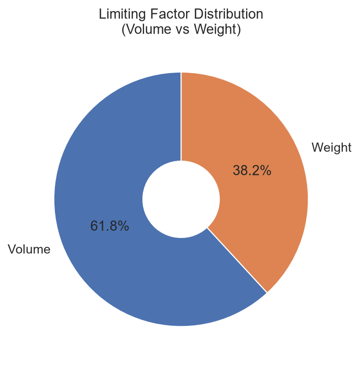
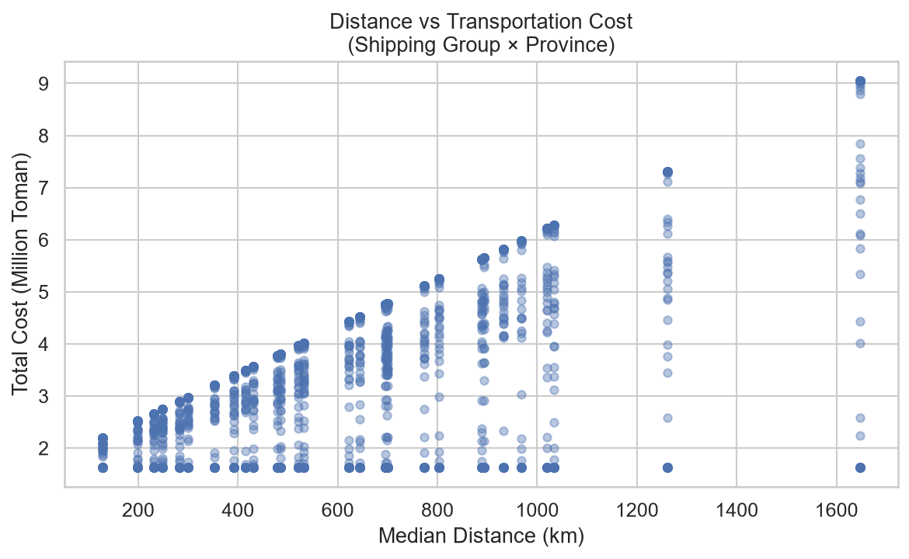
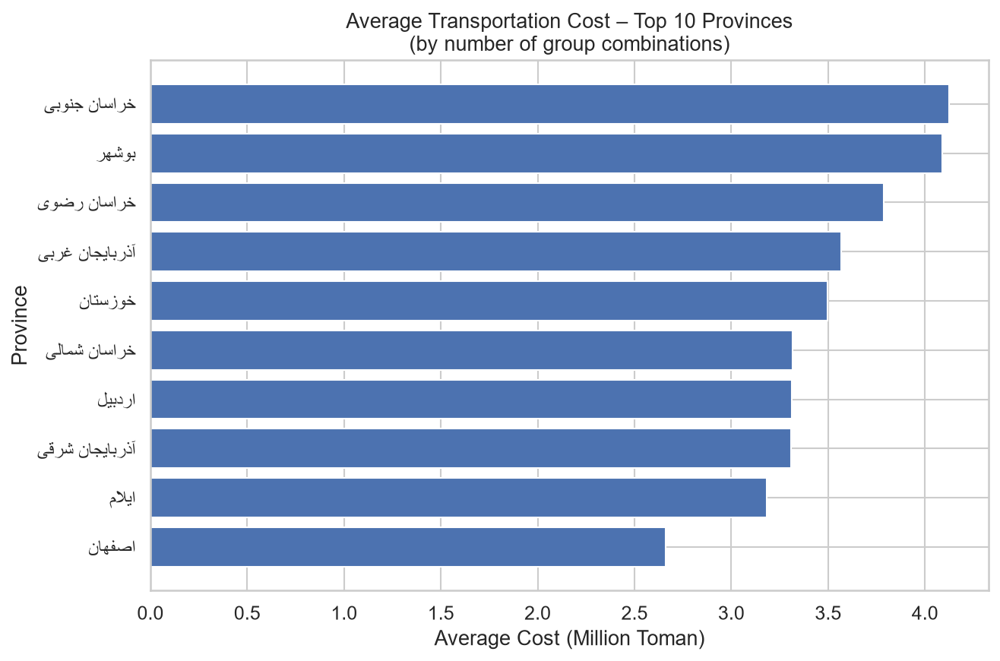

# Transportation Pricing & Cost Optimization

Real-world logistics analytics case study for transportation capacity planning, freight cost calculation, and pricing standardization.

## Business Problem

In large-scale logistics operations, transportation pricing is influenced by multiple factors:

- Product volume and weight
- Vehicle capacity constraints
- Distance to destination
- Shipping group
- Loading/unloading costs
- Road transportation charges

The goal of this project was to build a transparent and consistent calculation framework that supports logistics planning and cost optimization.

## Analytical Approach

1. Product master data preparation  
2. Volume & weight analysis  
3. Vehicle capacity constraint analysis  
4. Loading quantity calculation  
5. Limiting factor detection (volume vs weight)  
6. Destination & distance mapping  
7. Transportation cost calculation  
8. Shipping Group × Province pricing  
9. Shipping Group × City pricing  
10. Product × Province pricing  

## Business Logic

Maximum loadable quantity is determined by the tighter of two constraints:

- Volume capacity  
- Weight capacity  

The model identifies which constraint is binding for each product. This helps understand whether efficiency is limited by space or by weight.

## Key Insights

- Many products are limited by volume rather than weight, leaving unused payload capacity on the truck.
- Transportation cost increases sharply with distance because insurance and percentage-based surcharges are applied on top of the base cost.
- Province-level median distances are useful for high-level planning, while city-level distances reveal significant cost differences within the same province.
- Grouping products by shipping group makes cost matrices more practical for commercial and planning teams.

## Visual Results







## Project Structure

```
├── data/                          # Input data (main.xlsx – not published)
├── notebooks/
│   ├── 01_data_exploration.ipynb
│   ├── 02_capacity_analysis.ipynb
│   └── 03_transportation_pricing.ipynb
├── src/
│   └── transportation_cost_calculator.py
├── results/                       # Generated output files
└── docs/
    ├── 01_business_problem.md
    ├── 02_Transportation_Pricing_Methodology.md
    └── 03_business_insights.md
```
## How to Run

1. Place your `main.xlsx` file (sheets: `Data` and `Loc`) inside the `data/` folder.
2. Install dependencies:

```bash
pip install pandas numpy openpyxl
```
3. Run the calculator:
```
python src/transportation_cost_calculator.py
```

## Output Files

| File | Description |
|------|-------------|
| `01_Product_Capacity.xlsx` | Loading quantity, loaded weight and limiting factor per product |
| `02_Group_Summary.xlsx` | Summary statistics by shipping group |
| `03_Group_x_Province.xlsx` | Cost matrix: Shipping Group × Province |
| `04_Group_x_City.xlsx` | Cost matrix: Shipping Group × City |
| `05_Product_x_Province_FULL.csv` | Full Product × Province cost matrix |
| `05_Product_x_Province_Sample.xlsx` | Sample of the above for easier viewing |

## Documentation

- [Business Problem](docs/01_business_problem.md)
- [Transportation Pricing Methodology](docs/02_Transportation_Pricing_Methodology.md)
- [Business Insights](docs/03_business_insights.md)

## Tech Stack

- Python
- Pandas
- NumPy
- Excel / openpyxl
- Jupyter Notebook

## Notes

- Real commercial rates and company-specific data are not included in this repository.
- The calculation logic is fully documented; actual tariff values remain confidential.